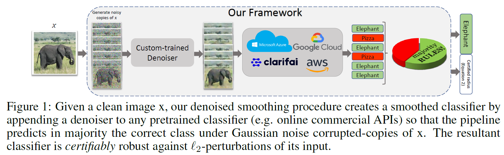
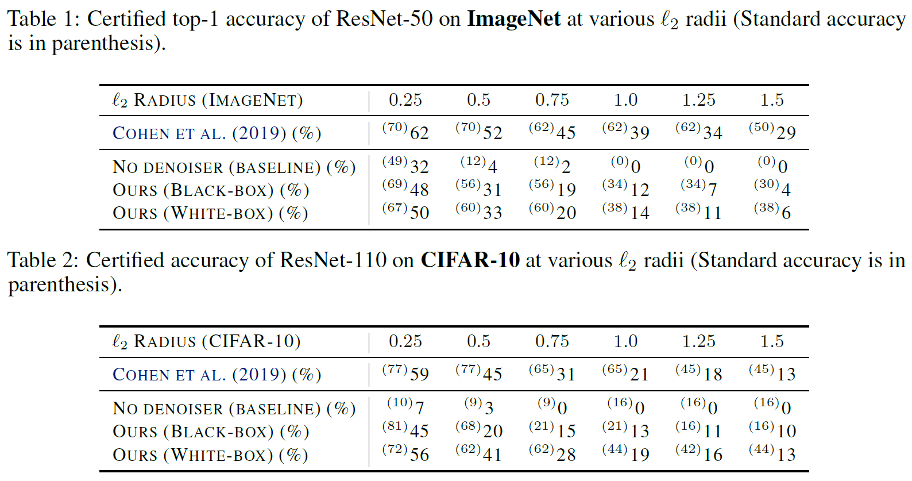
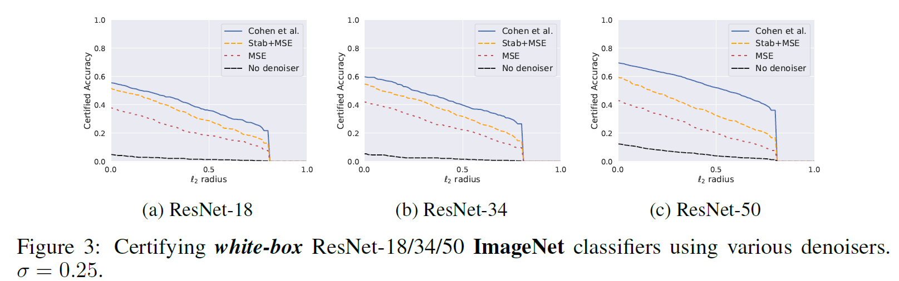

# Denoised Smoothing: A Provable Defense for Pretrained Classifiers

This repository contains the code and models necessary to replicate the results of our recent paper:

**Denoised Smoothing: A Provable Defense for Pretrained Classifiers** <br>

Our paper presents a method for provably defending any pretrained image classifier against Lp adversarial attacks.

<p>

</p>

<p>

</p>
 
## Overview of the Repository

Our code is based on the open source codes of [Cohen et al (2019)](https://github.com/locuslab/smoothing) and [Salman et al. (2019)](https://github.com/Hadisalman/smoothing-adversarial/). The major contents of our repo are as follows:

* [vision_api/](vision_api) contains the code for our experiments on online Vision APIs. **Check out the [tutorial](vision_api/tutorial.ipynb)!**

    ```python
    # To robustify an ONLINE api (api_name can be "azure", "google", "aws", "clarifai")
    majority_class, _, _ = RobustAPI(api_name, denoiser=denoiser, online=True).predict(img, ...)
    majority_class, radius, logs = RobustAPI(api_name, denoiser=denoiser, online=True).certify(img, ...)

    # To use the OFFLINE version (i.e. read from previous query logs, no denoiser needed)
    majority_class, _ = RobustAPI(api_name, online=False).predict(logs, ...)
    majority_class, radius = RobustAPI(api_name, online=False).certify(logs, ...)
    ```

* [code/](code) contains the code for our experiments on CIFAR-10 and ImageNet.
* [data/](data) contains the log data from our experiments.
* [analysis/](analysis) contains the plots and tables, based on the contents of [data/](data), that are shown in our paper.

Let us dive into the files in [code/](code):

1. `train_classifier.py`: a generic script for training ImageNet/Cifar-10 classifiers, with Gaussian agumentation option, achieving SOTA.
2. `train_denoiser.py`: the main code of our paper which is used to train the different denoisers used in our paper.
3. `train_denoiser_multi_classifier.py`: a variant of `train_denoiser.py` that allows training denoisers using multiple surrogate models.
4. `test_denoiser.py`: a script to test the performance of the denoiser on reconstruction task, and on image classification under Gaussian noise when a pretrained classifier is attached to the denoiser.
5. `visualize.py`:  a script for visualizing noisy images and denoised images.
6. `certify.py`: Given a pretrained smoothed classifier, returns a certified L2-radius for each data point in a given dataset using the algorithm of [Cohen et al (2019)](https://github.com/locuslab/smoothing).
7. `architectures.py`: an entry point for specifying which model architecture to use per classifiers and denoisers.

## Getting started

1.  `git clone https://github.com/authorneurips2020/paper-2900.git`

2.  Install dependencies:
```
conda create -n denoised-smoothing python=3.6
conda activate denoised-smoothing
conda install numpy matplotlib pandas seaborn scipy==1.1.0
conda install pytorch torchvision cudatoolkit=10.0 -c pytorch # for Linux
pip install google-cloud-vision boto3 clarifai
```

3. Download our trained models (denoisers and classifiers) from [here](https://drive.google.com/open?id=1MCXSKlz8qYQOGqMhbqmwN4Y0YPNMxVj6). Then move the downloaded `pretrained_models.tar.gz` into the root directory of this repo. Run `tar -xzvf pretrained_models.tar.gz` to extract the models.

4. If you want to run ImageNet experiments, obtain a copy of ImageNet and preprocess the val directory to look like the train directory by running [this script](https://raw.githubusercontent.com/soumith/imagenetloader.torch/master/valprep.sh). Finally, set the environment variable `IMAGENET_DIR` to the directory where ImageNet is located.

5. Let us try to certify the robustness of a CIFAR-10 pretrained model with an attached MSE-trained DnCNN denoiser.
```
pretrained_classifier="pretrained_models/cifar10_classifiers/ResNet110_90epochs/noise_0.00/checkpoint.pth.tar"
denoiser="pretrained_models/trained_denoisers/cifar10/mse_obj/dncnn/epochs_90/noise_0.25/checkpoint.pth.tar"
output="certification_output/sigma_0.25"
python code/certify.py --dataset cifar10 --base_classifier $pretrained_classifier --sigma 0.25 --outfile $output --skip 20 --denoiser $denoiser
```
Check the results in `certification_output/sigma_0.25`. You should get similar to [these results]( data/certify/cifar10/mse_obj/MODEL_resnet110_90epochs_DENOISER_cifar10_dncnn_epochs_90/noise_0.25/test_N10000/sigma_0.25).

**Are they similar? Perfect! You can keep going.**

## Example
Let's now convert a pretrained *non-robust* CIFAR-10 classifier to a provably robust one!

In what follows we will show you how you can train a denoiser on CIFAR-10 using the MSE objective, attach it to a pretrained classifier, then certify the robustness of the resultant robust classifier. This is the pretrained model we consider
```
pretrained_classifier="pretrained_models/cifar10_classifiers/ResNet110_90epochs/noise_0.00/checkpoint.pth.tar"
```

#### Training the denoiser
* To train a denoiser with MSE loss to denoise Gaussian noise of stddev of 0.25, run the following
```
python code/train_denoiser.py --dataset cifar10 --arch cifar_dncnn --outdir denoiser_output_dir --noise 0.25
```
Lazy to train? No worries, we have trained one for you! Just run the following in the command-line, and continue with the example
```
denoiser_output_dir=pretrained_models/trained_denoisers/cifar10/mse_obj/dncnn/epochs_90/noise_0.25 
```

#### Test the denoiser
Let's check how good the trained denoiser is,
```
python code/test_denoiser.py --dataset cifar10 --denoiser $denoiser_output_dir/checkpoint.pth.tar --clf $pretrained_classifier --noise 0.25
```

#### Certification
* Certify the trained model on CIFAR-10 test set using &sigma;=0.25
```
python code/certify.py --dataset cifar10 --base_classifier $pretrained_classifier --sigma 0.25 
--outfile certification_output/sigma_0.25 --skip 20 --denoiser $denoiser_output_dir/checkpoint.pth.tar
```
will load the `$denoiser` and attach it to the pretrained classifier `$pretrained_classifier`, smooth it using a noise level &sigma;=0.25, and certify 500 samples of the cifar10 test set.

If you check the results in `certification_output/sigma_0.25`, you should again get similar to [these results]( data/certify/cifar10/mse_obj/MODEL_resnet110_90epochs_DENOISER_cifar10_dncnn_epochs_90/noise_0.25/test_N10000/sigma_0.25).

So what? What has just happened? In fact, you have just converted a pretrained CIFAR-10 model into a provably robust one (for each image of the CIFAR-10 test set, you have a certified L2 radius within which the prediction is constant!) 

Let's try to certify the pretrained classifier **without** using a denoiser and compare the certification results.
```
python code/certify.py --dataset cifar10 --base_classifier $pretrained_classifier --sigma 0.25 
--outfile certification_output/sigma_0.25_no_denoiser --skip 20
```
The output`certification_output/sigma_0.25_no_denoiser` should be something like [these results]( data/certify/cifar10/no_denoiser/MODEL_resnet110_90epochs/noise_0.00/test_N10000/sigma_0.25).

Note that now most of the images are misclassified.

## Replicate our tables and figures
We provide code to generate all the tables and results of our paper. Simply run 

```
python code/analyze.py
```
This code reads from [data/](data) i.e. the logs that were generated when we certifiied our trained models, and automatically generates the tables and figures that we present in the paper.

Below are example plots from our paper which you will be able to replicate by running the above code.

<p>

</p>


## Download our pretrained models
**You can download our trained models [here](https://drive.google.com/open?id=1MCXSKlz8qYQOGqMhbqmwN4Y0YPNMxVj6)**. These contain all our trained denoisers and pretrained classfiers that we use in our paper.
